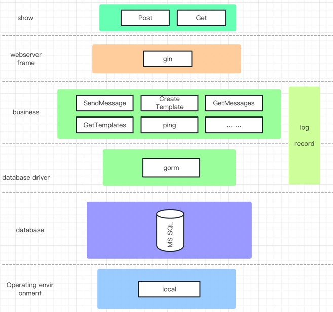
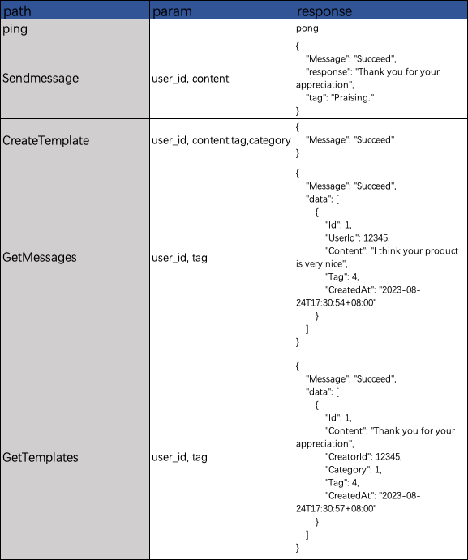

# chatbot

Design:

 

Table define:
~~~
CREATE TABLE `templates` (  
`id` INT NOT NULL AUTO_INCREMENT,  
`content` TEXT NOT NULL,  
`creator_id` INT NOT NULL,  
`category` TINYINT NOT NULL DEFAULT 0,  
`tag` TINYINT NOT NULL DEFAULT 0,  
`created_at` DATETIME NOT NULL,  
PRIMARY KEY (`id`),
INDEX `creator_id_tag` (`creator_id`, `tag`)
);
~~~

~~~
CREATE TABLE `messages` (
`id` INT NOT NULL AUTO_INCREMENT,
`user_id` INT NOT NULL,
`content` TEXT NOT NULL,
`tag` TINYINT NOT NULL DEFAULT 0,
`created_at` DATETIME NOT NULL,
PRIMARY KEY (`id`),
INDEX `user_id_tag` (`user_id`, `tag`)
);
~~~

API:

